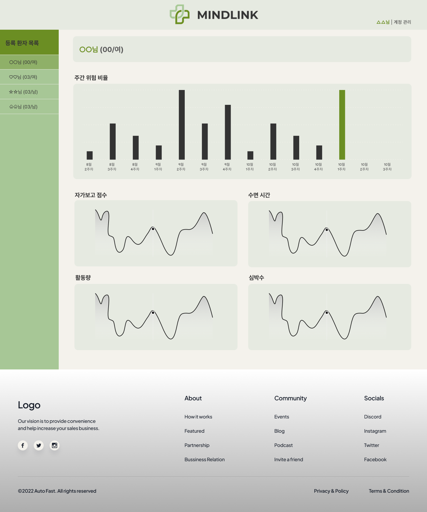

# Hack-heartai

웨어러블 기기 및 스마트폰 센서 데이터를 기반으로 정신 건강 상태를 예측하는 시스템입니다.

## 시스템 구조

```
Hack-heartai/
├── backend/          # FastAPI 백엔드 서버
├── frontend/         # React 프론트엔드
├── model/            # 머신러닝 모델 학습 및 저장
```

## 주요 기능

### 1. 데이터 수집
- 자가보고 점수
- 신체 활동량 (걸음 수)
- 수면 시간
- 심박수

### 2. 데이터 분석
- 주별 데이터 집계
- 정신건강 위험도(0/1)
- 주요 행동 변화 인자 식별

### 3. 의료진용 보고서
- 주요 행동 변화 인자 그래프
- 정신건강 위험도(0/1) 예측값

## 배포 및 인프라

### 인프라 / 배포
- **AWS Lambda** (Container Image)
- **Amazon ECR**
- **GitHub Actions** (CI/CD)

### API 문서화
- **Swagger** (FastAPI 내장)

### 보안 / 인증
- **Lambda Function URL**

## 🚀 팀원 소개
|김수정|성나연|오혜인|이동현|
|:-:|:-:|:-:|:-:|
||||
|[@peachily](https://github.com/peachily)|[@nayeonnn22](https://github.com/nayeonnn22)|[@haein45](https://github.com/haein45)|[@cauchy-P](https://github.com/cauchy-P)|

### 시안
